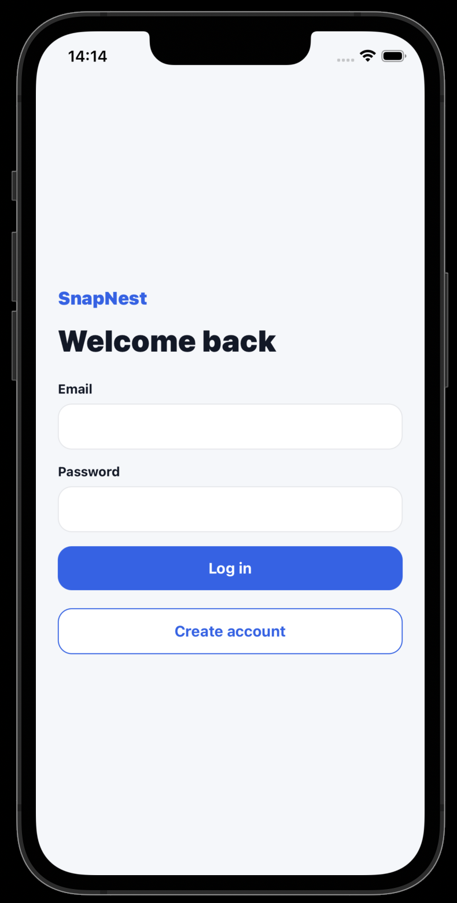
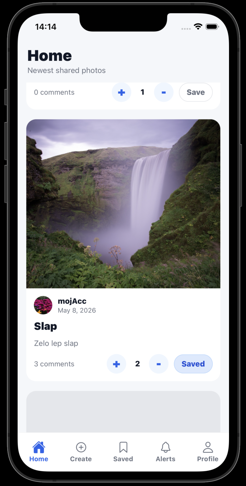
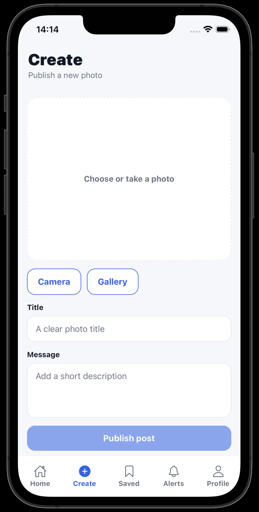
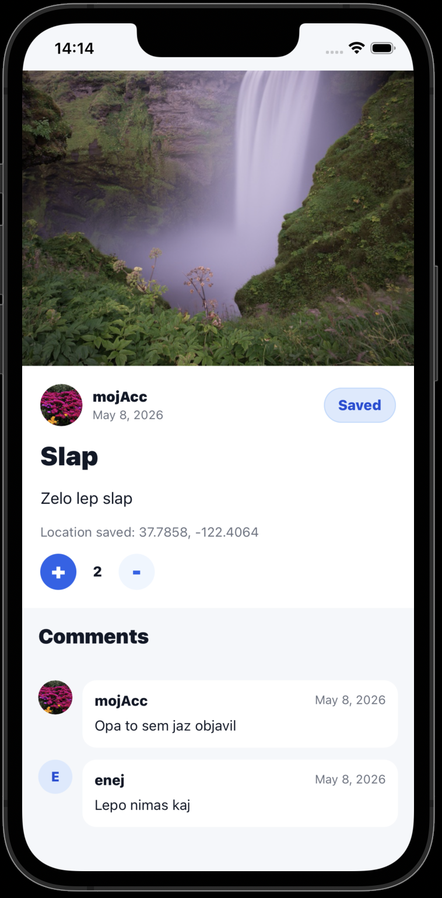
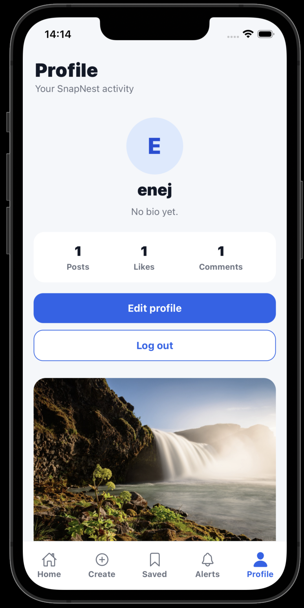

# SnapNest

React Native project made for university practice, but I got a bit too invested in it.

## Features

- user registration
- login and logout
- public image feed without login
- logged-in user feed
- image upload from camera or gallery
- post title and description
- image storage with Supabase Storage
- post storage with Supabase PostgreSQL
- optional GPS location saving when posting
- like / dislike system
- post comments
- post detail view
- profile editing
- user avatar
- user bio
- profile statistics:
  - number of posts
  - number of received likes
  - number of comments
- saving favorite posts
- offline favorite posts with AsyncStorage
- push notification setup:
  - asks for permission
  - gets Expo push token
  - saves token to Supabase

## Tech

- React Native
- Expo SDK 54
- Supabase

## Screenshots

  
  
  

  
  

